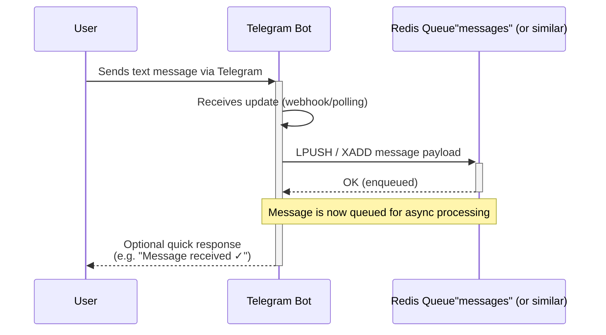

# Notification Crafter: A consrainted LLM based smart notification bot

## Описание проекта
Телеграм-Бот, создающий умные уведомления на основе неформальных описаний пользователя, например "Напомни сегодня вечером передать счетчики".

## Основной пайаплайн
Пользователь пишет в тг бота свой запрос в неформальном виде, запрос встает в очередь и далее обрабатывается LLM моделью с GBNF постпроцессором, на выходе из модели генерируется JSON объект, описывающий правила постинга уведомления (уведомления шлются так же через переписку с ботом).

Созданные JSON'ы пишутся в отдельную NOSQL базу данных, откуда подбираются и постятся по правилам с таймстемпом - JSON объекты имеют в явном виде время, когда `MSG_STRING` должен быть отправлен, опционально сколько раз `SEND_X_TIMES` и с какой периодичностью `SEND_TIME_DELTA`; потенциально может содержать альтернативное правило остановки - ТРЕБУЕТСЯ ПРОРАБОТКА И ОЦЕНКА ФИЧИ.

## JSON схема правил уведомлений
```json
"properties": {
    "msg_string": {
        "description": "Message text that would be sent and displayed"
        "type": "string"
    },
    "send_time": {
        "type": "timestamp", 
        "format": "YY.MM.dd HH:mm:ss"
    },
    "send_x_times": {
        "type": "int"
    },
    "send_time_delta": {
        "type": ""
    },
},

```

Возможно, правильнее исключить `SEND_X_TIMES` и `SEND_TIME_DELTA` - на этапе после LLM просто создать копии оригинального сообщения с самостоятельными таймстемпами рейнджом.

## Схема системы
!!! Это пока просто заглушка!!!

