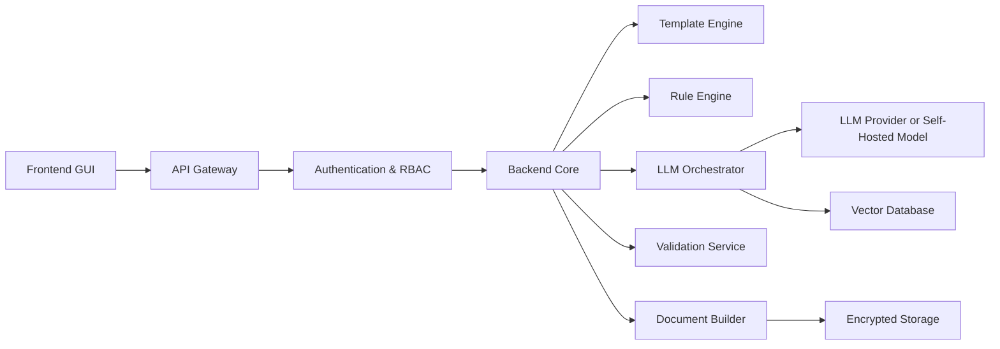
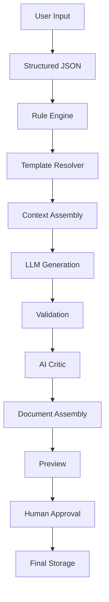

# AI Contract Generation Platform  
## Technical Architecture, Security & Model Strategy Blueprint (v1.0)

#  Executive summary

## Objective
Develop a SaaS multi-tenant AI-powered contract generation platform that:

- Generates 3–5 standardized contract types (MVP)
- Operates in a semi-automated (human-in-the-loop) mode
- Ensures strong corporate data protection
- Supports Russia (MVP) and scales to EU
- Is architected for enterprise security from day one
- Allows flexible LLM strategy (API-first → optional self-host later)

---

# Product scope

## Jurisdictions
- MVP: Russia
- Phase 2: EU (DACH priority)

## Contract types (MVP)
- Service Agreement
- NDA
- Supply Agreement
- Contractor Agreement
- Agency Agreement (optional)

## Approval model
- AI generates draft
- Human review required
- Final save only after manual approval
- Optional legal department review workflow

---

# Core architectural principle
> The system must function without LLM.  
> AI is an assistive layer — not the source of truth.

Contracts are based on:
- Legally validated templates
- Deterministic rule engine
- Structured data input

LLM enhances:
- Clause formulation
- Adaptation to special conditions
- Risk scanning
- Stylistic normalization

---

# System architecture


---

# System components

## Frontend

??

## Backend
Python FastAPI

Responsibilities
- Pipeline orchestration
- Tenant isolation
- Draft lifecycle management
- Logging & monitoring
- Model routing

Draft Lifecycle: CREATED → GENERATED → VALIDATED → REVIEWED → APPROVED → STORED

---

## Template engine
LLM must NOT generate contracts from scratch.

Templates:
- Legally reviewed
- Version-controlled
- Parameterized
- Conditional blocks supported

Tech: docxpl / python-docx

## Rule engine
LLM must not enforce compliance rules.

Examples:
- If amount > X → penalty clause required
- If advance > 30% → guarantee clause
- If EU → GDPR clause mandatory

Implementation:
- Python validation logic
- JSON-based policy registry
- Optional Open Policy Agent

## LLM orches
Responsibilities:
- Prompt assembly
- RAG injection
- Section-by-section generation
- JSON enforcement
- Retry logic

Structured output required:
```
{
  "clauses": {
    "liability": "...",
    "payment_terms": "...",
    "termination": "..."
  }
}
```

never request full free-form contract generation

## Validation
Level 1 — Schema
- Required fields present
- JSON valid

Level 2 — Logical
- Date consistency
- Numeric validation
- Cross-field checks

Level 3 — AI Critic
- Clause conflict detection
- Risk scanning
- Policy alignment

## Document builder
- Template merge
- DOCX generation
- PDF conversion
- SHA-256 hash
- Immutable audit record

# Full generation pipeline


# Tenant Isolation
- Tenant ID at database level
- Namespaced vector DB
- Per-tenant encryption keys
- Scoped API tokens
- Rate limiting per tenant

Infrastructure
- AWS/GCP (EU-ready)
- Kubernetes
- Private subnets
- No public DB access
- LLM service isolated

# Security
## Identity & access
Azure AD / MFA / determine RBAC roles

## Data protection
AES-256 at rest + tls1.3 in transit + field-level encr. no raw prompt logging

## Prompt injection defense
- immutable system prompt
- user sandboxed
- meta-instructio filtering
- secondary injection detection model

## Traceability
log:
- user id
- tenant id
- template version
- model version
- prompt hash
- output hash
- timestamp

# Model strategy
## Requirements:
- Stable structured output
- Legal language consistency
- Context ≥ 16k tokens
- Low hallucination
- JSON reliability

candidates:
| model | type | pros | cons |
| --- | --- | --- | --- |
| gpt-4.1 / 4o | api | best json stability | vendor dependency |
| claude 3.5 sonnet | api | strong reasoning | cost |
| gemini 1.5 pro | api | large context | variability |
| llama 3 70b | self-host | full control | infra heavy |
| mixtral 8x22b | self-host | efficient | tuning |

## Quantized / non-quantized models
- non-quantized (fp16 / bf16): pros - max precision + stable output; cons - expensive gpu
- quantized (8-bit / 4-bit): pros - lower memory usage + cheaper inference; cons - slight reasoning degradation + json instability risk

# Fundamental limitations
- Hallucinations cannot be fully eliminated
- Legal validity depends on template quality
- No in-house lawyer = structural risk
- Law changes over time
- LLM non-determinism