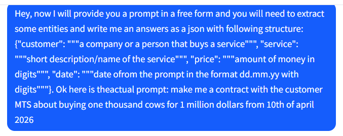
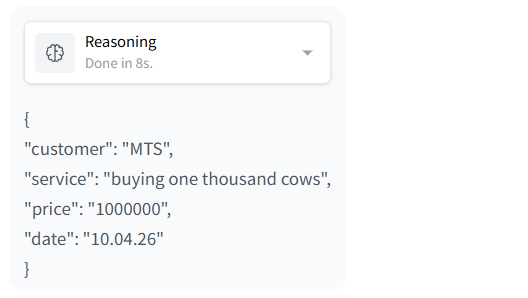

# Type contracts crafter: a constrained LLM-based contracts draft system.
## Описание проекта
Система, позволяющая генерировать типовые договоры по текстовому запросу в свободной форме на основе уже имеющейся базы данных договоров.
## Фундаментальнные ограничения
Прежде чем описывать архитектуру, необходимо ввести ограничения, которые позволят сделать MVP за необходимый срок (1 месяц):
* Зафиксировать 1–2 типа договоров (например: оказание услуг + NDA).
* Генерация не с нуля: только из шаблона + заполение конкретных секци.
* LLM не придумывает факты: реквизиты/названия/адреса/подписанты только из БД.
* Выходной формат: DOCX / PDF.

## Общее описание архитектуры:
#### Элементы:
1) Frontend-часть с формой для промпта
2) База данных с договорами
3) LLM для обработки пользовательского промпта
4) Бэкенд-часть с основной логикой приложения
#### Общий пайплайн
1) Пользователь вводит промпт в форму, промпт отправляется на бэкенд.
2) На бэкенде промпт поступает в LLM вместе с service prompt и мы получаем ответ (необходимые поля для генерации типового договора в структурированном виде).
3) Ответ LLM валидируется, при наличии проблем пользователю выводится сообщение, например "не хватает такой-то информации."
4) Если ответ прошел валидацию, из базы данных подтягиваются необходимые шаблоны договоров и на основе них и информации из пользовательского запроса генерируется новый типовой договор.
5) Договор валидируется и затем создается DOCX / PDF документ.

## Пайплайн обработки промпта с помощью LLM
Пользователь вводит промпт в форму, LLM обрабатывает его и выдает структуру в json формате, например:
```
{
  "contract_type": "service_agreement",
  "counterparty_name": "Компания N",
  "service_description": "услуга K",
  "date": "2026-03-12",
  "amount": 50000,
  "currency": "EUR",
  "missing_fields": [],
  "additional_info": ""
}
```
#### Возможный вариант решения задачи:
* Service prompt: объясняем модели какую стрктуру она должна выдавать и какие сущности извлекать из юзер промпта
* User prompt: непосредственно запрос пользователя на генерацию договора


<b>Пример запроса в Qwen3-8B:</b>



#### Возможные проблемы:
* Пользователь не дал всю необходимую информацию в запросе -> надо провалидировать и сообщить пользователю какой информации не хватает
* Модель неправильно определяет сущности -> опять же надо валидировать
* Модель выдает неправильную структуру на выходе (например лишние запятые в json разметке) -> возможно стоит использовать GBNF для более контролируемой генерациии.

#### Выбор модели:
* Необходима легковесная модель для локального безопасного запуска, возможно квантованный Qwen3-8B.

#### Непонятные моменты:
* Стоит ли давать LLM свободно генерировать некоторые места договора в корректном юридическом стиле? Например, можно делать краткое описание услуги.
